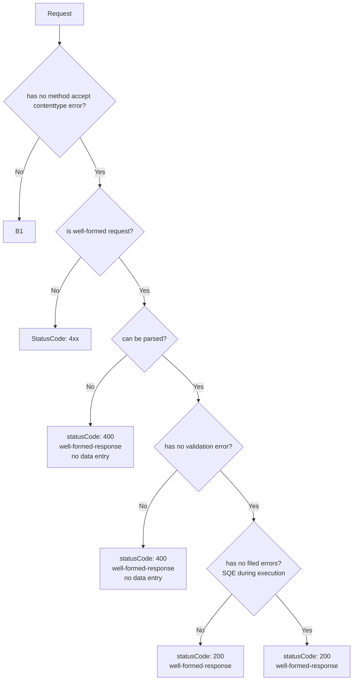
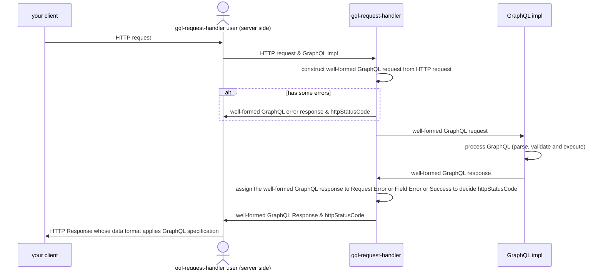

# gqls


is well-formed request?



well-formed-response
https://spec.graphql.org/draft/#sec-Response-Format

```
If a request error is raised, the data entry in the response must not be present, the errors entry must include the error, and request execution should be halted.
```
より、基本的には well-formed-response で返すのが良さそう




This Library User knows the types of well-formed GraphQL request and well-formed GraphQL response. 

Spec update

1. fetch
2. assign spec id it's man= manually paragraph or line or semantics block it depends on human.
3. relate spec id in imple files or ignores
4. build gh-page-build.ts
  - It also checks whether all spec ids are in imple or ignores.
5. main branch docs index.html it is published automatically